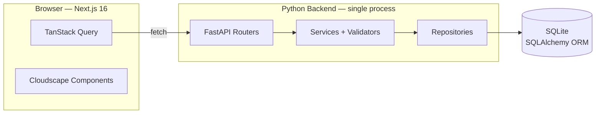
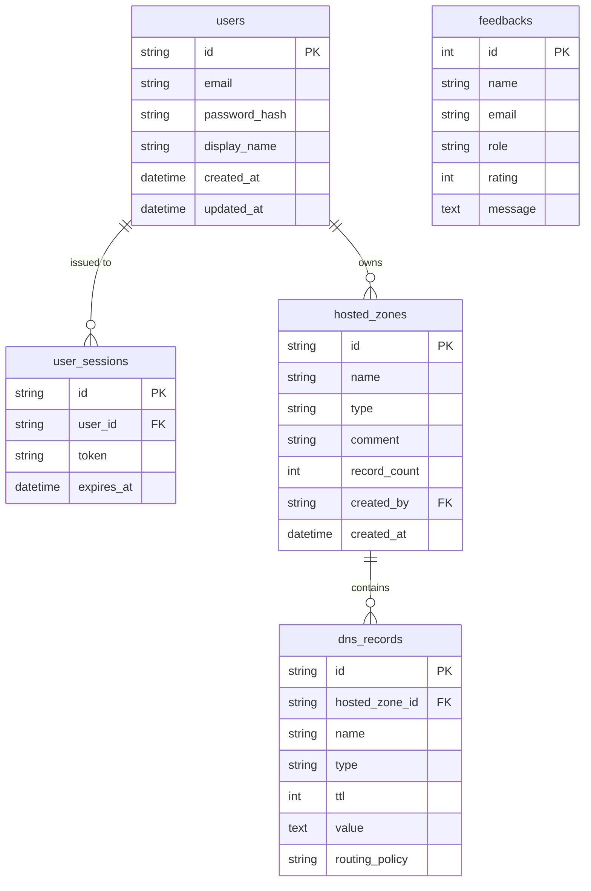

<p align="center">
  
</p>

<h1 align="center">Route 53 Clone</h1>

<p align="center">A high-fidelity clone of the AWS Route 53 console — built to feel like the real product, not a generic CRUD app.</p>

<p align="center">
  <strong>Live:</strong> <a href="https://route53.sarvee.in">route53.sarvee.in</a><br/>
  <strong>API Docs:</strong> <a href="https://route53-sonn.onrender.com/docs">route53-sonn.onrender.com/docs</a>
</p>

---

## What's actually built

- Mocked auth with bcrypt password hashing and 7-day session tokens (login, register, logout, session persistence across reloads)
- Hosted zones full CRUD — create, list, search, edit, delete, bulk delete — with auto-created NS and SOA records
- DNS records full CRUD inside each zone, supporting A, AAAA, CNAME, TXT, MX, NS, PTR, SRV, and CAA with per-type value validation
- BIND zone file import with a server-side parser that handles `$ORIGIN`, `@`, comments, and skips duplicates
- JSON and BIND export for any hosted zone
- Dashboard with live KPI tiles (total zones, public/private split, total records) and a 7-day activity sparkline
- Cloudscape Design System throughout — same components AWS uses internally, so the tables, forms, modals, pagination, and notifications all look and behave identically
- Dark mode with localStorage persistence, toggle in the settings dropdown
- Keyboard shortcuts (`c` create record, `/` focus search, `r` refresh)
- Bulk delete for both hosted zones and DNS records with confirmation modals
- Custom 404 page and runtime error boundary matching the AWS console style
- Coming soon pages for Health Checks, Traffic Policies, Resolver (6 sub-routes), Profiles, CIDR Collections, Domains, Global Resolvers, Policy Records, and Shared DNS Views
- Mocked IAM, AWS Accounts, Organizations, and Billing endpoints

**What's explicitly not built:** actual DNS resolution. Records don't propagate anywhere — this is a UX clone, not a DNS server.

---

## Tech Stack

**Backend:** FastAPI · SQLAlchemy 2.x · Pydantic v2 · bcrypt · Alembic · SQLite  
**Frontend:** Next.js 16 (App Router) · React 19 · TypeScript · Cloudscape Design System · Tailwind CSS v4 · TanStack Query

---

## Architecture

The most important decision was using AWS's own Cloudscape Design System for the frontend instead of hand-rolling components. Cloudscape is the exact component library AWS uses across their console — so the tables, forms, modals, breadcrumbs, and top navigation are the real thing, not approximations. The tradeoff: Cloudscape is opinionated about layout and theming, so custom CSS is kept to a minimum (only Tailwind for the search bar and a few layout tweaks).



### Backend layering — strict one direction

```text
routers/  →  services/  →  repositories/  →  models/
                ↕               ↕
           validators/      SQLAlchemy session
                ↕
            schemas/ (Pydantic shapes shared across layers)
```

Only `repositories/` touches the SQLAlchemy session. Services own commits, business invariants, and per-type validation. Routers parse input, call the service, shape the response — nothing more. This kept each file small and testable.

### Frontend layering

```text
page.tsx  →  features/  →  lib/api/  →  apiFetch  →  HTTP  →  Backend
                ↕
         providers/ (Auth, Theme, Notifications, Query, Breadcrumb)
```

Each page is thin — it wires up TanStack Query hooks and delegates rendering to feature components. The API client is the single fetch call site that adds the auth bearer token and decodes the error envelope.

### Why session tokens, not JWT

JWT is stateless — validate the signature, trust the payload, done. But stateless JWTs can't be revoked: a stolen token stays valid until expiry. I used opaque session tokens stored in a `user_sessions` table so logout actually invalidates the token. The extra DB lookup on each request is the cost; actual logout is the benefit.

### Why SQLite

The assignment asked for SQLite. It's a single-file database with no server process — perfect for a demo. SQLAlchemy's ORM layer means switching to Postgres later is a one-line config change (`DATABASE_URL`).

---

## Database Design

SQLite with SQLAlchemy 2.x. Primary keys are Route 53-style IDs — zones get `Z` + 20 base32 chars, records get `R` + 20 base32 chars. This matches how real Route 53 IDs look (`Z1D623PEXAMPLE`).

**5 tables:** `users` · `user_sessions` · `hosted_zones` · `dns_records` · `feedbacks`

### Entity Relationship Diagram



### Full schema

<details>
<summary>Click to expand all tables</summary>

**`users`** — accounts

| Column | Type | Notes |
|---|---|---|
| `id` | TEXT PK | UUID |
| `email` | TEXT UNIQUE | login identifier |
| `password_hash` | TEXT | bcrypt |
| `display_name` | TEXT | shown in UI |
| `created_at`, `updated_at` | DATETIME | |

**`user_sessions`** — one row per login

| Column | Type | Notes |
|---|---|---|
| `id` | TEXT PK | UUID |
| `user_id` | FK → users CASCADE | |
| `token` | TEXT UNIQUE | 64-char hex, bearer token |
| `expires_at` | DATETIME | issued + 7 days |
| `created_at`, `updated_at` | DATETIME | |

**`hosted_zones`** — DNS zones

| Column | Type | Notes |
|---|---|---|
| `id` | TEXT PK | `Z` + 20 base32 chars |
| `name` | TEXT | domain with trailing dot |
| `type` | TEXT | `PUBLIC` or `PRIVATE` |
| `comment` | TEXT | user description, max 256 chars |
| `record_count` | INTEGER | cached count, updated on record CRUD |
| `created_by` | FK → users CASCADE | owner |
| `created_at`, `updated_at` | DATETIME | |
| | CHECK | `type IN ('PUBLIC', 'PRIVATE')` |
| | UNIQUE | `(created_by, name, type)` — no duplicate zones per user |

**`dns_records`** — records within a zone

| Column | Type | Notes |
|---|---|---|
| `id` | TEXT PK | `R` + 20 base32 chars |
| `hosted_zone_id` | FK → hosted_zones CASCADE | |
| `name` | TEXT | fully qualified domain name |
| `type` | TEXT | A, AAAA, CNAME, TXT, MX, NS, PTR, SRV, CAA, SOA |
| `ttl` | INTEGER | 0–604800 seconds, default 300 |
| `value` | TEXT | record value, validated per type |
| `routing_policy` | TEXT | default `SIMPLE` |
| `created_at`, `updated_at` | DATETIME | |

**`feedbacks`** — recruiter/reviewer feedback (public, no auth)

| Column | Type | Notes |
|---|---|---|
| `id` | INTEGER PK | autoincrement |
| `name` | TEXT | nullable |
| `email` | TEXT | nullable |
| `role` | TEXT | nullable |
| `rating` | INTEGER | 1–5 |
| `message` | TEXT | required |
| `created_at`, `updated_at` | DATETIME | |

</details>

---

## API Overview

### Authentication

| Method | Path | Description |
|--------|------|-------------|
| POST | `/api/auth/register` | Create account → token + user |
| POST | `/api/auth/login` | Login → token + user |
| POST | `/api/auth/logout` | Invalidate session |
| GET | `/api/auth/me` | Current user profile |

### Hosted Zones

| Method | Path | Description |
|--------|------|-------------|
| GET | `/api/hosted-zones` | List (paginated, searchable, filterable, sortable) |
| POST | `/api/hosted-zones` | Create (auto NS + SOA) |
| GET | `/api/hosted-zones/{id}` | Details |
| PATCH | `/api/hosted-zones/{id}` | Update comment |
| DELETE | `/api/hosted-zones/{id}` | Delete (cascades records) |
| POST | `/api/hosted-zones/bulk-delete` | Bulk delete |

### DNS Records

| Method | Path | Description |
|--------|------|-------------|
| GET | `/api/hosted-zones/{id}/records` | List in zone |
| POST | `/api/hosted-zones/{id}/records` | Create in zone |
| GET | `/api/records/{id}` | Single record |
| PATCH | `/api/records/{id}` | Update (ttl, value) |
| DELETE | `/api/records/{id}` | Delete |
| POST | `/api/records/bulk-delete` | Bulk delete |

### Import / Export

| Method | Path | Description |
|--------|------|-------------|
| POST | `/api/hosted-zones/{id}/import` | Import BIND zone file |
| GET | `/api/hosted-zones/{id}/export?format=json` | Export JSON |
| GET | `/api/hosted-zones/{id}/export?format=bind` | Export BIND |

### Stats & Mock

| Method | Path | Description |
|--------|------|-------------|
| GET | `/api/stats` | Dashboard counts |
| GET | `/api/stats/activity` | 7-day activity |
| GET | `/api/aws/iam` | Mocked IAM |
| GET | `/api/aws/account` | Mocked account |
| GET | `/api/aws/organizations` | Mocked orgs |
| GET | `/api/aws/billing` | Mocked billing |
| POST | `/api/feedback` | Submit feedback |
| GET | `/api/health` | Health check |

Full interactive docs at `/docs` (Swagger UI) when the backend is running.

---

## Test Account

Pre-seeded with 2 hosted zones (`example.com.`, `staging.example.com.`) and 12 DNS records (A, AAAA, CNAME, MX, TXT, NS, SOA).

| Email | Password |
|---|---|
| demo@example.com | demo1234 |

You can also register a new account from the signup page — it creates a real session and works immediately.

---

## Local Setup

### Backend

```bash
cd backend
python3 -m venv .venv
.venv/bin/pip install -r requirements.txt
.venv/bin/uvicorn app.main:app --reload --port 8000
```

Seed demo data (idempotent):

```bash
.venv/bin/python -m app.seed
```

### Frontend (second terminal)

```bash
cd frontend
npm install
npm run dev    # http://localhost:3000
```

**Demo login:** `demo@example.com` / `demo1234`

### Environment

Backend reads from `backend/.env` (see `backend/.env.example`). All have defaults — locally you typically change nothing.

Frontend reads `NEXT_PUBLIC_API_BASE_URL` (default `http://localhost:8000`). See `frontend/.env.example`.

### Deployment

The app is deployed at:

- **Frontend:** [route53.sarvee.in](https://route53.sarvee.in) (Vercel)
- **Backend:** [route53-sonn.onrender.com](https://route53-sonn.onrender.com) (Render, free tier)

Backend uses a `Procfile` that runs Alembic migrations, seeds demo data, then starts uvicorn. A GitHub Actions cron pings the health endpoint every 10 minutes to prevent the free tier from sleeping.

---

## Repository Layout

```text
backend/
  app/
    main.py              FastAPI factory + routers
    core/                config, database, deps, security, exceptions, ids
    models/              ORM tables
    schemas/             Pydantic request/response shapes
    repositories/        Sole DB-access layer
    services/            Business logic + zone bootstrap
    validators/          Per-record-type value rules
    routers/             Thin HTTP layer
    seed.py              Demo data
  alembic/               Migrations
  tests/                 pytest

frontend/
  src/
    app/
      login/             AWS sign-in flow
      signup/            AWS signup flow
      (console)/         Auth-gated console routes
        dashboard/
        hosted-zones/    list, create, [zoneId], [zoneId]/edit
        health-checks/   coming soon
        resolver/        coming soon (6 sub-routes)
        profiles/        coming soon
        ...
      not-found.tsx      Custom 404
      error.tsx          Runtime error boundary
    components/shell/    Top nav, side nav, breadcrumbs, app shell
    features/            auth, records, dashboard
    providers/           Auth, Theme, Notifications, Query, Breadcrumb
    lib/api/             Typed API client
    types/               Shared types
```

---

## Bugs I actually fixed

These tell you more about the codebase than a feature list does.

**Top nav didn't match AWS layout.** The initial top nav used a generic header with a logo and links. Rebuilt it with Cloudscape's `TopNavigation` component and the actual AWS console structure — services dropdown, search bar, region selector, account menu with dark mode toggle. Had to work around Cloudscape's fixed icon set and the fact that `TopNavigation` expects an `i18nStrings` prop that isn't well documented.

**Login page was a single form.** AWS uses a two-step sign-in flow — email first, then password. Rebuilt the login form to match: step 1 asks for email, step 2 shows the password field with the email above it. The "Create account" link goes to the signup page, which mirrors AWS's actual signup flow.

**Theme toggle flashed the wrong colors on hard refresh.** `ThemeProvider` set `.dark` on `<html>` inside `useEffect` — after the first paint. Fixed with a synchronous inline `<script>` in `<head>` that reads `localStorage` before React renders. Same technique `next-themes` uses.

**Theme didn't sync across tabs.** Switching theme in one tab didn't update others. Replaced `useState` with `useSyncExternalStore` listening to `storage` events. Now all open tabs update instantly.

**Edit button on hosted zones table was disabled.** The list page had View and Edit buttons greyed out because the edit page didn't exist. Built the edit page at `/hosted-zones/[zoneId]/edit` and wired the button to navigate there with the selected zone ID.

**Vercel build failed — `@tailwindcss/postcss` not found.** Tailwind v4 was in `devDependencies` but Vercel doesn't install devDependencies in production. Moved `tailwindcss` and `@tailwindcss/postcss` to `dependencies` and added a `tw:gen` script that runs before `next build` to generate the Tailwind CSS file.

**Render deployed Python 3.14 instead of 3.11.** Free tier defaults to the latest Python. `pydantic-core` wheels weren't available for 3.14 yet. Fixed by adding `.python-version` with `3.11.9` (which Render reads) and unpinning `pydantic` to allow compatible wheels.

**Render went cold between requests.** Free tier suspends after 15 minutes idle. Fixed with a GitHub Actions cron that pings `/api/health` every 10 minutes.

---

## Assumptions

- **No actual DNS resolution.** Records are stored and displayed but don't propagate anywhere. This is a UX clone, not a DNS server. Plugging in a real resolver would require a DNS backend like PowerDNS or CoreDNS.
- **SQLite over Postgres.** Zero infrastructure for local dev. The SQLAlchemy layer is DB-agnostic — switching is a one-line connection string change. The tradeoff is no concurrent writes at scale.
- **Mocked auth, not AWS IAM.** Sessions are opaque tokens in a `user_sessions` table, not JWTs. Logout deletes the row. The extra DB lookup per request is worth it for a demo where reviewers log in and out.
- **Mocked IAM, Accounts, Organizations, Billing.** These endpoints return static placeholder data. The real AWS APIs require SigV4 signing and an AWS account — out of scope for a 24-hour assignment.
- **Cloudscape over custom components.** Using AWS's own design system meant the UI looks right without pixel-pushing CSS. The tradeoff is working within Cloudscape's constraints — fixed icon set, layout patterns, and theming tokens that don't always map cleanly to Tailwind.
- **BIND import is parser-only.** The import handles `$ORIGIN`, `@`, comments, and common record types. It skips duplicates rather than merging. A full BIND parser would handle `$INCLUDE`, `$TTL`, and quoted strings — overkill for this demo.

---

## License

MIT
